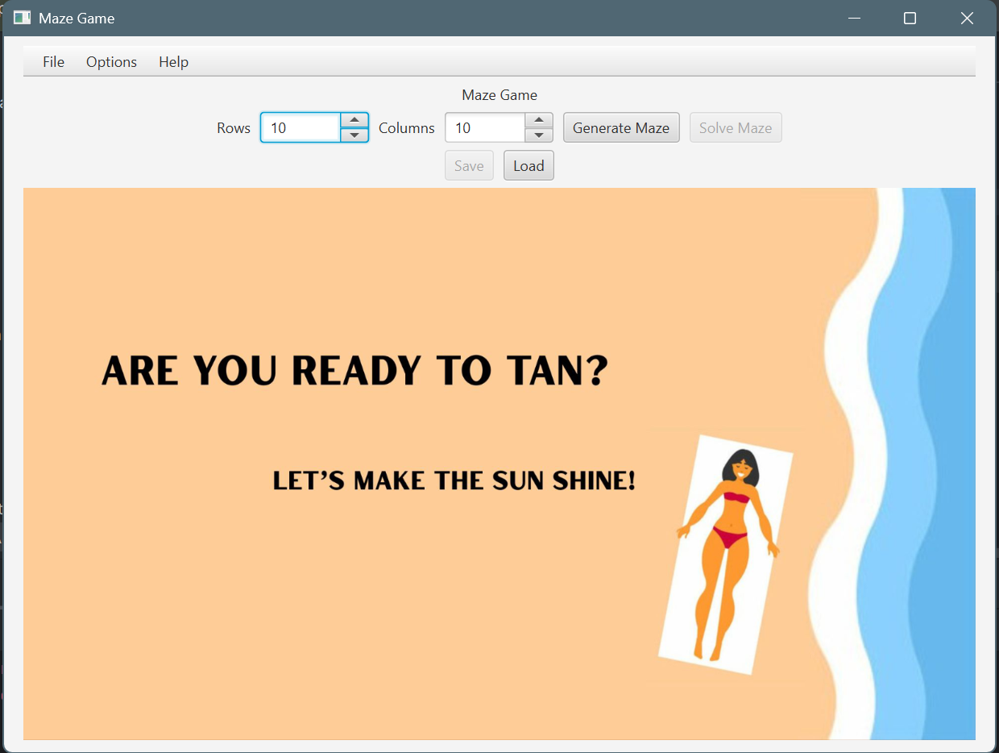
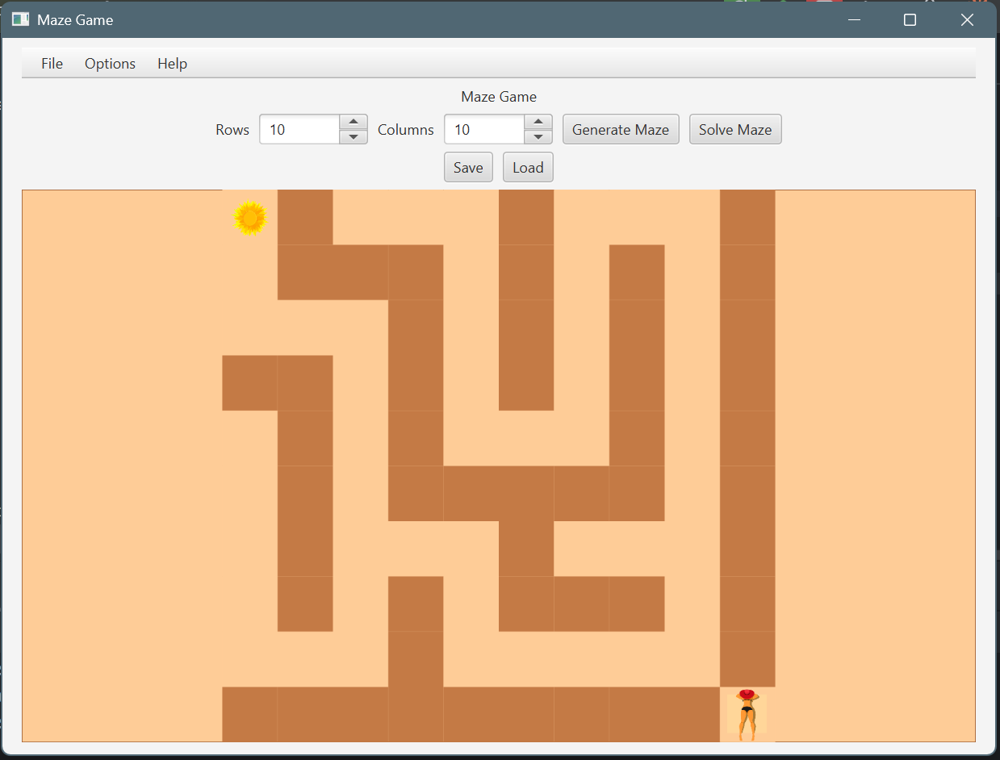

# Maze Desktop Application

A JavaFX desktop game for generating, navigating, saving, loading, and solving mazes. The application combines a graphical MVVM interface with local client-server communication, maze compression, and search algorithms.

## Screenshots

### Welcome screen

<p align="center">
  
</p>

### Maze gameplay

<p align="center">
  
</p>

## Features

- Generate solvable mazes with configurable dimensions.
- Navigate horizontally, vertically, and diagonally using the keyboard.
- Move to a nearby valid cell by dragging with the mouse.
- Zoom the maze with `Ctrl` + mouse wheel.
- Display a solution path calculated with Best-First Search.
- Save mazes to `.maze` files and load them later.
- Generate and solve mazes through two local multithreaded servers.
- Compress maze data during client-server transfer.
- Show a visual celebration when the goal is reached.

## Technologies

- Java 15 language level
- JavaFX 16 and FXML
- Maven Wrapper 3.8.5
- JUnit 5
- Log4j 2
- MVVM architecture
- TCP client-server communication

## Requirements

- JDK 15 or newer
- An internet connection for Maven's first dependency download

The project has been verified with Oracle JDK 25. Maven itself does not need to be installed because the repository includes the Maven Wrapper.

## Run the application

From the repository root on Windows PowerShell:

```powershell
.\mvnw.cmd javafx:run
```

On macOS or Linux:

```bash
./mvnw javafx:run
```

The application starts two servers on available local ports. They stop when the application is closed normally.

## Controls

| Action | Control |
| --- | --- |
| Move up, down, left, or right | Arrow keys or `8`, `2`, `4`, `6` |
| Move diagonally | `7`, `9`, `1`, `3` |
| Move with the mouse | Drag the player to a neighboring valid cell |
| Zoom | Hold `Ctrl` and use the mouse wheel |

The movement numbers work with either the number row or the numeric keypad.

## Test and build

Run the automated tests on Windows:

```powershell
.\mvnw.cmd test
```

Create the JAR:

```powershell
.\mvnw.cmd package
```

On macOS or Linux, replace `.\mvnw.cmd` with `./mvnw`.

Build output is written to `target/`. The generated JAR contains the project classes and resources, but JavaFX and the other dependencies are managed by Maven; use `javafx:run` for the documented development run command.

## Project structure

```text
src/
├── main/
│   ├── java/
│   │   ├── algorithms/   # Maze generation and search algorithms
│   │   ├── Client/       # TCP client
│   │   ├── IO/           # Maze compression and decompression
│   │   ├── model/        # Application model and server coordination
│   │   ├── Server/       # Multithreaded server infrastructure
│   │   ├── view/         # JavaFX view and controllers
│   │   └── viewModel/    # MVVM view model
│   └── resources/        # FXML, configuration, logging, and media
└── test/java/            # JUnit tests
```

## Configuration

Default runtime settings are loaded from `src/main/resources/config.properties`. The application uses a four-thread server pool, `MyMazeGenerator` for generation, and Best-First Search for solving unless those defaults are overridden.

## Academic context and attribution

This application originated as a collaborative course project completed with another student. The repository therefore represents shared academic work and should not be interpreted as the work of a single contributor.

The current repository also includes later cleanup and portfolio-preparation work, including Maven restructuring, dependency cleanup, testing, and replacement media assets.

Media sources and licenses are documented in [`src/main/resources/media/ATTRIBUTION.md`](src/main/resources/media/ATTRIBUTION.md).

## License

No license has been selected for the source code yet. The media files retain the licenses documented in the attribution file.
